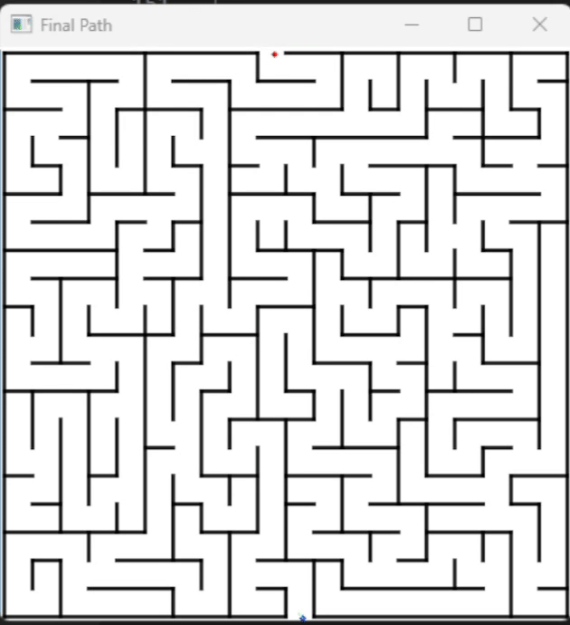

# A* Algorithm for Maze Solving
--------------
## Algorithm



A* is an algorithm to find the shortest path in a maze. The maze is represented as image with black walls and white spaces for the robot to walk in it.

Given:
- Start point is (x<sub>s</sub>, y<sub>s</sub>)
- Goal point is (x<sub>g</sub>, y<sub>g</sub>)

The algorithm starts at the goal point and label every valid neighboring cell (not an obstacle) with the value 1 (means 1 step from the goal) and so if a cell with cost n it means it's n steps from the goal. To discover less number of cells, the algorithm combine the cost with heuristic function. The function is the manhattan distance from the point to the start. This means the algorithm will be in favor of the cells closer to the start point.

--------------

## Implementation

Map is loaded with 2 versions the original and balck and white image for the maze. 

The algorithm is implemented in the `AStar` function. The function takes the map, start and goal points and return the path from the start to the goal. The function uses the `PriorityQueue` to store the cells to be visited. The cells are stored with the cost and the heuristic value. The algorithm is implemented as follows:

```python

while priority_queue:
        current_cost, current_node, path = heapq.heappop(priority_queue)
        
        if current_node in visited:
            continue

        visited.add(current_node)
        path = path + [current_node]
        
        if current_node == start:
            return path
        
        for neighbor in neighbors(map, current_node):
            if neighbor not in visited:
                if safe_radius !=0:
                    if nearest_obs(map, neighbor) < safe_radius:
                        continue
                # Add the heuristic cost to the priority queue
                heapq.heappush(priority_queue, (current_cost + 1 + np.linalg.norm(np.array(neighbor) - np.array(start)), neighbor, path))
    
    return None  # If no path exists
```

The function `neighbors` is used to get the valid neighbors of a cell. The function `nearest_obs` is used to get the distance to the nearest obstacle from a cell to avoid the robot to get too close to the obstacles.

```python
def nearest_obs(map: np.ndarray, point: tuple) -> int:
    '''
    Returns the distance to the nearest obstacle from the given point.

    Args:
        map: The map of the maze.
        point: The point to find the distance to the nearest obstacle from.

    Returns:
        int: The distance to the nearest obstacle from the given point.
    '''
    dist = 1
    while True:
        try:
            # Sum of cells in the side of the square of size 2*dist + 1
            sum_cells = np.sum(map[point[0]-dist, point[1]-dist:point[1]+dist+1]) + np.sum(map[point[0]+dist, point[1]-dist:point[1]+dist+1]) + np.sum(map[point[0]-dist+1:point[0]+dist, point[1]-dist]) + np.sum(map[point[0]-dist+1:point[0]+dist, point[1]+dist])
        except IndexError:
            dist += 1
            if dist >= 9:
                return 10
            continue
        num_cells = np.ceil((2*dist +1) **2 - (2*dist - 1) **2)
        # print(sum_cells, num_cells)
        if np.ceil(sum_cells / 255) < num_cells:
            return dist
        if dist >= 9:
            return 10
        dist += 1
```
--------------


